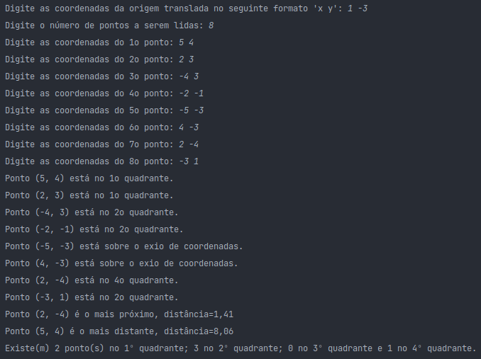
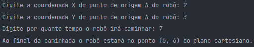

# Sistema de coordenadas 2D


## Demonstração

### Parte A



### Parte B



## Instalação

```bash
# Clonar o repositório
$ git clone https://github.com/ImGabreuw/sistema-de-coordenadas.git

# Navegar até o diretório com o script de teste do projeto
$ cd ./sistema-de-coordenadas/scripts

# Conceder permissão de execução para o script de teste
$ chmod +x ./test.sh

# Executar o script
$ sh ./test.sh
```

## 🤝 Colaboradores

<table>
  <tr>
    <td align="center">
      <a href="https://github.com/ImGabreuw">
        <br>
        <sub>
          <b>ImGabreuw</b>
        </sub>
      </a>
    </td>
  </tr>
</table>